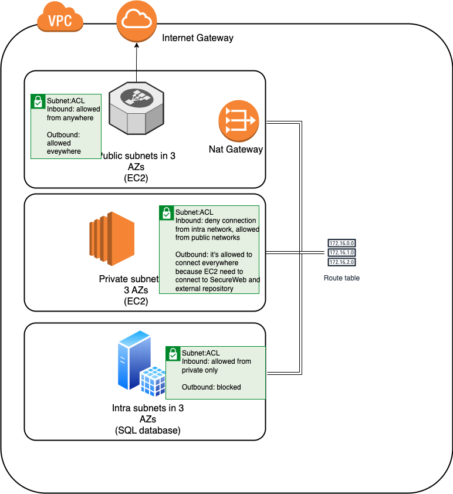

# PoC

Creates:
1. VPC with 3 Tier network
- public - ALB (public access)
- private - EC2 (internet access with not access from public network) - access to internet via single NAT gateway in public network
- intra - RDS (no internet access)
1. ASG with desired 1 machine
2. ALB with HTTP and HTTPS listener
3. RDS instance (MariaDB) in single AZ without backup and snapshots.

## Requirements
Specify variables:
- `domain` - name of hosted zone in Route53
- `domain_prefix` - domain prefix ALB FQDN
- `ssh_key_name` - SSH key name

Resources which need to exists in AWS:
1. Hosted zone - `domain`
2. TLS certificate in ACM - `domain_prefix` + `.` + `domain`

## Network diagram


## How to deploy
```
make plan
make apply
```
